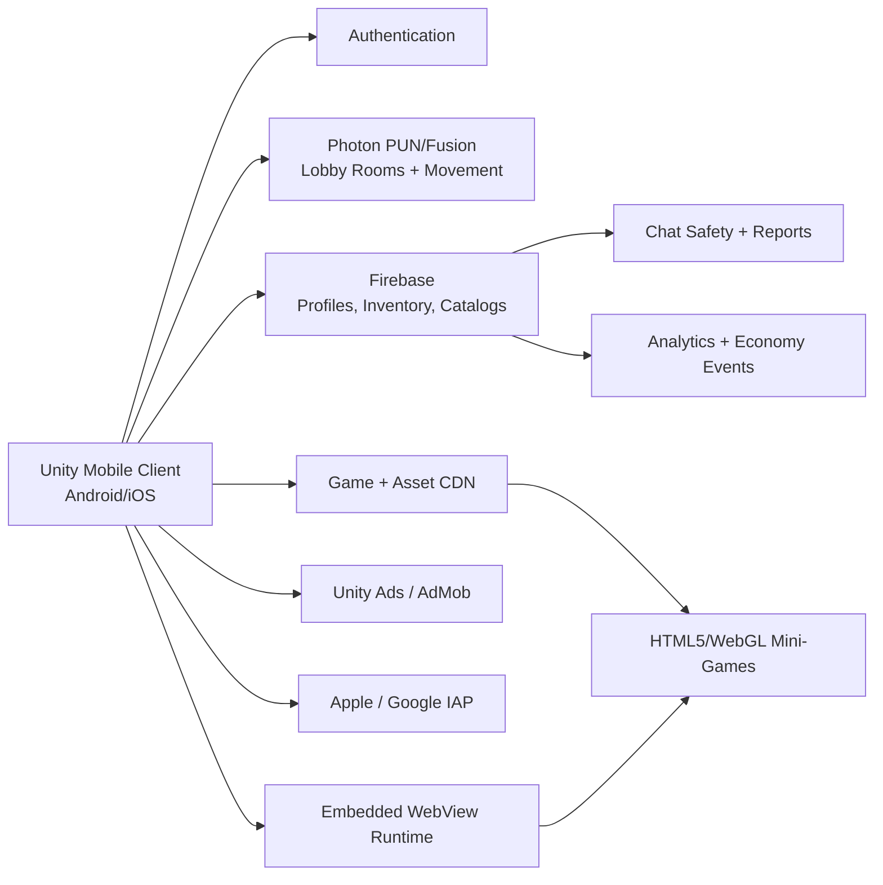

# Social Gaming Hub Architecture

## 1. Product Goal

Build a free-to-play mobile gaming hub for Android and iOS where players meet in a shared 3D roleplay city, socialize through real-time chat and emotes, customize avatars with equip-by-ID cosmetics, and instantly launch lightweight HTML5/WebGL mini-games through in-world portals.

The architecture is optimized for:

- Low-friction play: users can explore the lobby and launch games without large additional downloads.
- Social retention: live presence, chat, parties, roleplay spaces, cosmetics, and friend discovery keep players returning.
- Scalable content: new mini-games, cosmetic IDs, portal destinations, and marketplace items can be added server-side.
- Safe monetization: rewarded ads and optional purchases never block core play.

## 2. High-Level System Overview



The Unity client owns the 3D lobby, avatar rendering, player input, UI, WebView container, ad integration, and in-app purchase flows. Photon handles low-latency multiplayer state such as player transforms, emotes, room membership, and transient chat. Firebase stores persistent user state such as profiles, friends, inventory, item catalogs, portal configuration, purchases, moderation records, and analytics events.

## 3. Client Architecture

### 3.1 Unity Mobile App

Recommended Unity modules:

- **Lobby Scene**: streams a compact 3D city map with plazas, houses, race tracks, social hangout zones, and game portals.
- **Avatar System**: composes body, face, hair, clothing, accessories, animations, and nameplate/VIP tags from item IDs.
- **Portal Manager**: loads server-configured game portals and opens selected HTML5/WebGL games in an embedded WebView.
- **Social UI**: friend list, party invites, chat, emotes, profile cards, report/block controls, and marketplace entry points.
- **Economy UI**: soft currency balance, rewarded-ad unlocks, premium bundles, item preview, and purchase confirmation screens.
- **Network Layer**: abstracts Photon room operations and Firebase persistence so the gameplay code does not depend directly on vendor APIs.

### 3.2 Scene Flow

1. **Boot Scene** initializes config, remote feature flags, authentication, content version checks, analytics, and parental/safety gates where required.
2. **Lobby Scene** connects to a regional Photon lobby room and spawns the player's synchronized avatar.
3. **Portal Interaction** opens a mini-game detail panel showing title, genre, rating, player count, reward rules, and launch button.
4. **WebView Game Scene/Overlay** launches the selected HTML5/WebGL URL with a signed session token and returns result events to Unity.
5. **Reward Resolution** validates completion or score events server-side before granting currency, cosmetics, badges, or leaderboard progress.

### 3.3 WebView Mini-Game Integration

Use a production mobile WebView plugin that supports iOS WKWebView and Android WebView, JavaScript bridges, deep-link interception, fullscreen mode, safe-area handling, and lifecycle callbacks.

Mini-game launch flow:

1. Unity requests a signed launch token from Firebase Cloud Functions or a custom backend endpoint.
2. Unity opens the WebView with `gameUrl?session=<signed-token>&locale=<locale>&theme=<theme>`.
3. The HTML5 game sends bridge events to Unity for `ready`, `pause`, `resume`, `score_submitted`, `level_complete`, `ad_requested`, and `exit_requested`.
4. Unity forwards reward-relevant events to the backend for validation before granting items or currency.
5. Unity closes the WebView and returns the player to the same lobby location.

Bridge event contract example:

```json
{
  "event": "level_complete",
  "gameId": "obby_rooftop_run",
  "sessionId": "signed-session-id",
  "score": 12840,
  "durationSeconds": 181,
  "clientNonce": "random-per-launch-value"
}
```

## 4. Multiplayer Backend

### 4.1 Photon Responsibilities

Use Photon PUN or Photon Fusion for real-time session data:

- Region selection and lobby room matchmaking.
- Player join/leave presence.
- Avatar position, rotation, movement state, emotes, and vehicle state.
- Nearby chat routing or room chat relay when moderation requirements permit.
- Party co-location so friends can spawn into the same lobby shard.

Lobby scaling pattern:

- Target 30-60 visible players per lobby shard on mobile, depending on map density and device tier.
- Use interest management zones so clients receive high-frequency updates only for nearby players.
- Use lower update rates and interpolation for distant avatars.
- Split roleplay city districts into separate rooms when concurrency grows.

### 4.2 Firebase Responsibilities

Use Firebase for persistent and server-authoritative data:

- Firebase Authentication: anonymous, Apple, Google, and optional email sign-in.
- Cloud Firestore: profiles, friends, inventory, item catalogs, portal definitions, marketplace listings, and moderation records.
- Realtime Database or Firestore listeners: online status, lightweight notifications, party invites, and store refreshes.
- Cloud Functions: signed mini-game launch tokens, reward validation, purchase validation, catalog publishing, moderation automation, and economy grants.
- Cloud Storage/CDN: downloadable avatar thumbnails, icons, game art, addressable asset bundles, and marketing images.
- Analytics/Crashlytics/Remote Config: funnel metrics, crash diagnostics, A/B tests, feature flags, and economy balancing.

## 5. Avatar Customization System

### 5.1 Item ID Code System

Every equippable asset is represented by a stable public item ID. Players can type an item ID into an equip screen to preview and equip the matching garment, hairstyle, face, or accessory if it is free, owned, unlocked through ads, or purchasable.

Item ID format recommendation:

```text
<category>-<style>-<rarity>-<numeric-id>
```

Examples:

- `hair-bubblegum-rare-1042`
- `face-sparkle-free-0021`
- `top-neonhoodie-premium-3110`
- `vehicle-hoverboard-vip-0705`

### 5.2 Avatar Data Model

```json
{
  "userId": "uid_123",
  "displayName": "NovaRacer",
  "bodyPresetId": "body-default-0001",
  "equippedItems": {
    "hair": "hair-bubblegum-rare-1042",
    "face": "face-sparkle-free-0021",
    "top": "top-neonhoodie-premium-3110",
    "bottom": "bottom-denim-free-0008",
    "shoes": "shoes-runner-free-0100",
    "accessoryBack": "wings-mini-legendary-9001"
  },
  "colors": {
    "skinTone": "tone-06",
    "hairTint": "#ff80c8"
  }
}
```

### 5.3 Asset Pipeline

- Author cosmetics as modular meshes, skinned meshes, materials, texture atlases, or optimized prefabs compatible with the base avatar rig.
- Package content using Unity Addressables so new cosmetics can be downloaded on demand.
- Store item metadata in Firestore and binary assets in Cloud Storage or a CDN.
- Cache recently used cosmetics locally to reduce repeat downloads.
- Validate equip requests server-side so users cannot equip restricted, expired, or unowned IDs by modifying local save data.

### 5.4 Cosmetic Catalog Fields

| Field | Purpose |
| --- | --- |
| `itemId` | Stable public code users can enter. |
| `category` | Equip slot such as hair, face, top, bottom, shoes, pet, vehicle, or house. |
| `assetAddress` | Unity Addressables key or CDN asset reference. |
| `rarity` | Free, common, rare, epic, legendary, VIP, or event. |
| `unlockType` | Free, rewarded ad, soft currency, IAP, VIP, event, creator code, or admin grant. |
| `price` | Currency amount or product identifier when applicable. |
| `isTradable` | Enables future marketplace or gifting support. |
| `safetyStatus` | Approved, pending, rejected, or hidden. |

## 6. Roleplay City and Portal System

### 6.1 Lobby Map Design

Structure the city around social and gameplay districts:

- **Central Plaza**: spawn point, announcements, daily rewards, featured portals, and high-traffic social gathering.
- **Fashion District**: avatar shop, ID code booth, outfit preview mirrors, limited drops, and creator showcases.
- **Vehicle Zone**: test-drive area for hoverboards, bikes, karts, and premium vehicles.
- **Housing District**: instanced or semi-instanced homes, furniture placement, and party hangouts.
- **Game Arcade**: portal walls grouped by genre such as Action, Obbies, Racing, Puzzle, and Trending.

### 6.2 Portal Configuration

Portals should be data-driven so operations teams can add, remove, reorder, and promote mini-games without shipping a new app build.

```json
{
  "portalId": "portal_obby_rooftop_run",
  "gameId": "obby_rooftop_run",
  "displayName": "Rooftop Run",
  "genre": "Obby",
  "gameUrl": "https://cdn.example.com/games/obby-rooftop-run/index.html",
  "thumbnailUrl": "https://cdn.example.com/art/obby-rooftop-run.png",
  "minAppVersion": "1.0.0",
  "enabled": true,
  "featuredWeight": 80,
  "rewardRules": {
    "softCurrencyOnComplete": 25,
    "dailyCap": 250
  }
}
```

## 7. Monetization Architecture

### 7.1 Rewarded Ads

Rewarded ads should be voluntary and integrated into moments where the value exchange is clear:

- Unlock one premium clothing or hair ID for a limited trial.
- Earn soft currency for marketplace purchases.
- Refresh daily cosmetic choices.
- Continue a mini-game attempt.
- Speed up house or vehicle customization timers if those systems are added.

Ad reward flow:

1. Client requests ad availability and reward placement config.
2. User taps a clear opt-in button.
3. Unity Ads or AdMob shows the rewarded ad.
4. Client receives completion callback.
5. Cloud Function validates placement limits and grants the reward.
6. Client displays a reward receipt and updates inventory.

### 7.2 In-App Marketplace

Marketplace item categories:

- Exclusive hairstyles, outfits, faces, emotes, pets, and trails.
- Vehicles for faster city traversal or cosmetic flair.
- Roleplay houses, furniture packs, and themed rooms.
- VIP tags, nameplate frames, chat bubbles, and profile decorations.
- Seasonal bundles and event passes that remain optional.

Purchases must be validated server-side through Apple App Store and Google Play receipt validation before permanent inventory grants are written.

## 8. Safety, Trust, and Compliance

Because the product is social and youth-oriented, safety features are core architecture rather than optional polish:

- Use age-appropriate onboarding and region-specific compliance gates.
- Provide profanity filtering, personal information detection, rate limits, and safe preset chat modes.
- Add report, block, mute, and friend-request controls to every profile card.
- Keep moderation logs with timestamps, room IDs, user IDs, and recent chat context.
- Use server-side validation for currency grants, ad rewards, item equips, and mini-game completion.
- Avoid pay-to-win mechanics; monetize expression, convenience, and roleplay status instead.

## 9. Data Collections

Suggested Firestore collections:

| Collection | Key Documents |
| --- | --- |
| `users/{userId}` | Profile, display name, account age band, moderation status, balances, selected avatar. |
| `users/{userId}/inventory/{itemId}` | Owned cosmetics, vehicles, houses, unlock source, expiration, grant history. |
| `catalogItems/{itemId}` | Public item metadata, rarity, unlock type, asset address, pricing, status. |
| `portalConfigs/{portalId}` | Portal metadata, game URL, feature weights, reward rules, minimum app version. |
| `friendships/{friendshipId}` | Friend request and accepted-friend state. |
| `partyInvites/{inviteId}` | Party invite source, target, room destination, expiry. |
| `moderationReports/{reportId}` | Reporter, reported user, reason, room, evidence, status. |
| `economyEvents/{eventId}` | Server-written ledger for grants, spends, ad rewards, IAP grants, and reversals. |

## 10. Security Rules and Server Authority

Client writes should be limited to low-risk profile preferences and requests. High-value state must be written by Cloud Functions or trusted backend services.

Server-authoritative operations:

- Granting currency.
- Granting or revoking inventory.
- Validating purchases.
- Validating rewarded-ad completions.
- Publishing item catalogs and portal configs.
- Applying moderation penalties.
- Accepting mini-game scores for rewards or leaderboards.

## 11. Observability and Live Operations

Track these core metrics:

- Day 1, Day 7, and Day 30 retention.
- Lobby average concurrent users by region and shard.
- Portal impressions, launches, completions, exits, and crashes.
- Avatar ID searches, previews, equips, unlocks, and failed equip attempts.
- Rewarded-ad opt-in rate, completion rate, revenue per daily active user, and placement fatigue.
- Store impressions, conversion, refunds, and item popularity.
- Chat reports, blocks, moderation actions, and repeat-offender rates.

Use Remote Config for:

- Featured portals and event rotations.
- Ad placement caps and reward amounts.
- Cosmetic drop schedules.
- VIP benefits.
- Economy balancing.
- Safety mode toggles.

## 12. Initial Milestone Plan

### Milestone 1: Playable Social Lobby

- Unity mobile project with boot scene and 3D city prototype.
- Photon lobby room connection, movement sync, player spawn/despawn, and emotes.
- Firebase auth and basic profile creation.
- Safe chat prototype with moderation hooks.

### Milestone 2: Avatar and Item IDs

- Modular avatar rig and initial cosmetic slots.
- Firestore item catalog.
- Equip-by-ID UI with preview, ownership checks, and local caching.
- Addressables-based cosmetic download flow.

### Milestone 3: Mini-Game Portals

- Data-driven portal placement in the city.
- WebView launch flow with signed session tokens.
- JavaScript bridge event contract.
- Reward validation and return-to-lobby UX.

### Milestone 4: Monetization and Marketplace

- Rewarded ad placements with server-validated grants.
- Soft currency wallet and economy ledger.
- IAP product setup and receipt validation.
- Marketplace UI for cosmetics, vehicles, houses, and VIP tags.

### Milestone 5: Scale and Safety Hardening

- Interest management and lobby sharding.
- Report/block/mute polish and moderation dashboards.
- Analytics dashboards and live operations tools.
- Load testing, device performance profiling, and launch readiness review.
